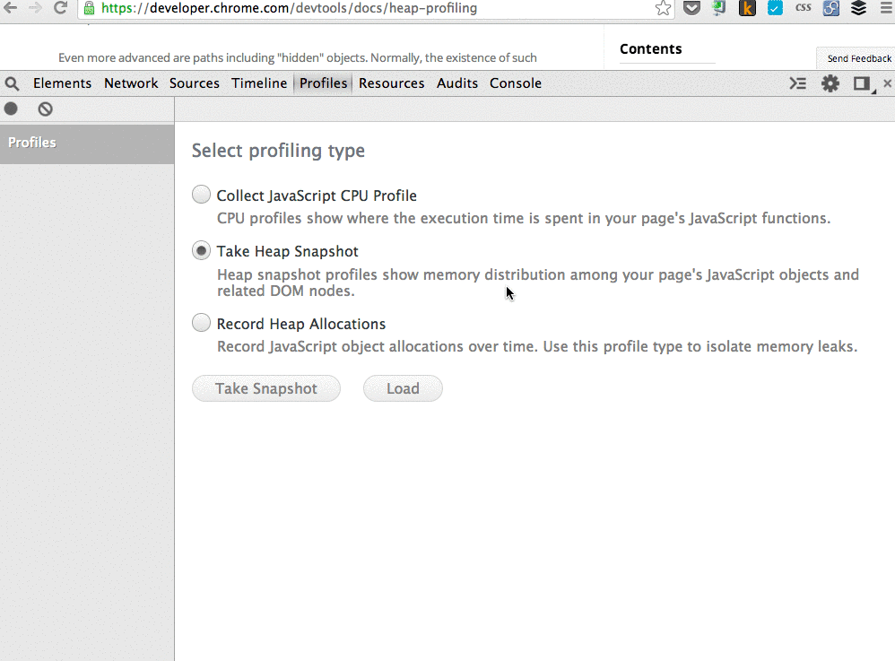

Dump Heap
=======

Basic chrome extension that dumps the heap of currently open tab

Follow the instructions from https://developers.google.com/web/tools/chrome-devtools/profile/memory-problems/memory-diagnosis?hl=en#discover-detached-dom-tree-memory-leaks-with-heap-snapshots

Calls
-----

* [browserAction.onClicked](https://developer.chrome.com/extensions/browserAction#event-onClicked)
* [debugger.attach](https://developer.chrome.com/extensions/debugger#method-attach)
* [debugger.detach](https://developer.chrome.com/extensions/debugger#method-detach)
* [debugger.onEvent](https://developer.chrome.com/extensions/debugger#event-onEvent)
* [debugger.sendCommand](https://developer.chrome.com/extensions/debugger#method-sendCommand)
* [runtime.lastError](https://developer.chrome.com/extensions/runtime#property-lastError)
